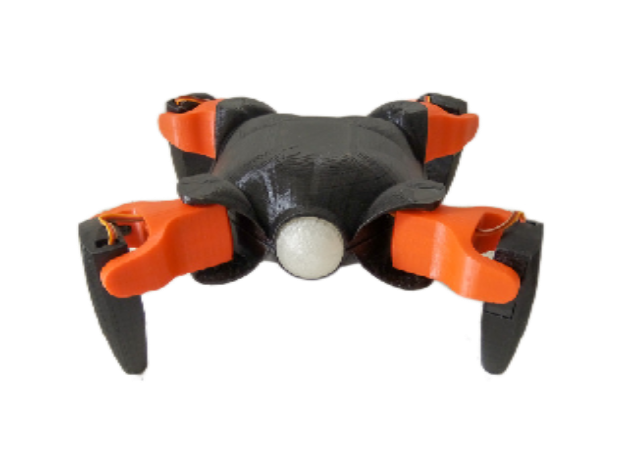

# Andi Haller's **Tridibot**

  

---------------------------------------------------------------------------------------------------------------------------------------------
We've had a soft spot for this adorable little robot for quite a while now. It's like love at first sight! Unlike most robots, Tridibot doesnt take the sceanic route like R2-Detour.  That's why we couldn't resist forking it from its original designer, the incredible **Andi Haller**. Now, **Andi** is an absolute genius when it comes to design and an awesome teacher! His creations not only captivate English-speaking audiences but also open up a world of inspiration for Spanish speakers. You can find him showcasing his incredible work on Instagram, YouTube, and probably other social networks too – he's just that good!

#### Prepare to be amazed!
And if you're not, well, shame on you! Maybe you should go find something else to do, like debugging your robotic dance moves or oiling the rusty gears of your humor module! Go organize your sock drawer or try counting sand grains! Your own mother probably didn't like you!

#### Now, we're planning to add our own unique touch to Ole' Tridi. We'll let our creativity run wild, we'll tinker and innovate for better or for worse. This is about having fun, right? Trying to improve any of **Andi's work** is the true challenge!

#### We've already included all the 3D files you'll need to print this little guy right here in this repository. No need to go searching on Thingiverse or anywhere else.

#### Oh, and by the way, everything else you're about to read in this readme? It's straight from **Andi's repository**. We wanted to give credit where credit is due, _(and probably have to for legal reasons and what nots)_ so grab your favorite filiment and get ready for an exciting journey!

---

-----------------------------------------------------------------------------------------------------------------------------------------------

Tridibot is an open source robot, originally created for educational purposes. You can download the code to build your own Tridibot from this repository. 

You can find the 3D design here https://www.thingiverse.com/thing:3050870

## How to:

First of all, you will need to install the Arduino IDE (if you don’t have it already). You can download it from here: https://www.arduino.cc/en/Main/Software

After that you have to add support for ESP8266 chip to the Arduino environment.

- Open Arduino and go to Preferences.
- Enter http://arduino.esp8266.com/stable/package_esp8266com_index.json into Additional Board Manager URLs field.
- Go to Boards Manager from Tools > Board menu and install esp8266 platform (and don't forget to select your ESP8266 board from Tools > Board menu after installation).

You can find more information here https://github.com/esp8266/Arduino 

The next step is to download the tool to upload files to the ESP file system. We recommend you to use ESP8266FS.

- Download the tool from https://github.com/esp8266/arduino-esp8266fs-plugin/releases/download/0.3.0/ESP8266FS-0.3.0.zip.  (Check for the updated version on the link below)
- In your Arduino sketchbook directory, create tools directory if it doesn't exist yet
- Unpack the tool into tools directory (the path will look like <home_dir>/Arduino/tools/ESP8266FS/tool/esp8266fs.jar)
- Restart Arduino IDE

The official project Doc: https://github.com/esp8266/Arduino/blob/master/doc/filesystem.rst 

#### Now we need to download some libraries:

1)	**ArduinoWebSockets** library by Links2004. Download it from https://github.com/Links2004/arduinoWebSockets  
2)	**ArduinoJson**, by bblanchon, https://github.com/bblanchon/ArduinoJson 
3)  **Adafruit_NeoPixel**, by adafruit, https://github.com/adafruit/Adafruit_NeoPixel

To install the libraries go to Sketch > Include Library > Add .ZIP Library and select the downloaded zip file. 

### Download the code.

So, now that we have downloaded everything, let’s upload the code to the microcontrollers.

#### ESP8266
1)	First we need to put the Tridibot in Programming mode. To do that, move the jumpers on the board.
2)	Connect an UART adapter:
- GND (UART) = GND (Board) 
- Rx (UART) = Tx (Board) 
- Tx (UART) = Rx (Board) 
- 3,3v (UART) = 3,3v (Board)
3)	Open one of the Sketches of the **Tridibot_ESP** folder.
4)	Go to Tools, Boards and select your ESP model.
5)	Again, go to Tools and click on the ESP8266 Sketch Data Upload (This step can take a few minutes, depending on your ESP and the upload speed of your UART adapter).
6)	After it finish uploading all files, hit the upload Sketch button.

#### Arduino
1)	Remove the UART adapter and all three jumpers
2)	Connect the Arduino board to your computer.
3)	Open the Sketch in the folder **Tridibot_arduino**.
4)	Select the correct Arduino model from the Board Menu.
5)	Upload the code.
6)	Put the jumpers back to the initial position.

### Finally
Please keep in mind that Tridibot is still work in progress and there is still a lot to improve! Because of that, Tridibot has the feature to upload code OTA (over the air). This comes in handy if you want to modify the code of the ESP (Firmware and the web server files). 

The OTA feature is basically copy paste from the **FSBrowser** example that comes with the ESP8266 board library, so if you want to know how to use it, I recommend you to check out that example.

If you are interested in this project and have a suggestion or you just want to say hi, feel free to contact me @TheAndiHaller or @konredus on Instagram!
